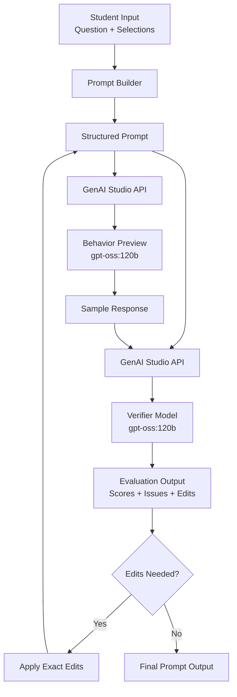

<p align="center">
  
</p>

<h1 align="center">🦫 PromptBeaver</h1>

<p align="center">
  Build better prompts. Learn better concepts.
</p>

---

## 🚀 Live Application

👉 https://promptbeaver.streamlit.app/

---

## 🎯 Overview

PromptBeaver is a prompt engineering tool designed for **undergraduate students in Computer Science, Data Science, and AI**.

It helps students:
- Generate structured prompts for conceptual questions  
- Understand how prompt design affects LLM behavior  
- Iteratively refine prompts using evaluation feedback  

Instead of hiding prompt engineering, PromptBeaver makes it **explicit, structured, and learnable**.

---

## 🧠 Core Workflow

```
User Input (question + selections)
   ↓
Prompt Builder
   ↓
GenAI Studio API → Behavior Preview
   ↓
GenAI Studio API → Verifier
   ↓
Edit Normalization
   ↓
Optional Revision
   ↓
Re-Verification
```

---

## 🏗️ System Architecture



This pipeline ensures prompts are not only generated, but **tested against real model behavior, evaluated with structured metrics, and iteratively improved**.

---

## 🔌 Model & API Details

All model calls are executed through the **Purdue GenAI Studio API**.

Models used:
- **Primary:** gpt-oss:120b  
- **Fallback:** llama4:latest  

Used for:
- Behavior preview (simulated first response)
- Prompt verification (LLM-as-judge evaluation)

Includes retry and fallback logic for reliability.

---

## 🧩 Features

### Structured Prompt Generation
- Interaction mode (Socratic, Guided Tutor, etc.)
- Question intent (clarify, walkthrough, reasoning check)
- Course-aligned concept selection

### Behavior Preview
- Shows how an LLM actually responds
- Detects answer leakage or misalignment

### Evaluation Metrics
- Alignment  
- Clarity  
- Constraint Adherence  
- Accuracy  

### Auto-Revision
- Applies exact prompt edits
- Re-runs evaluation instantly

---

## 🎓 Target Audience

Designed for:
- Computer Science students  
- Data Science students  
- AI / Machine Learning students  

Aligned with courses such as:
- CS 180 (Programming)
- CS 182 (Foundations)
- CS 251 / 253 (Data Structures & Algorithms)
- CS 373 (Machine Learning)

---

## 🔒 Design Principles

- No direct homework answers  
- Concept-first learning  
- Transparent prompt structure  
- Behavior-driven evaluation  

---

## 🤖 AI Disclosure

AI tools were used in a **supporting role only**:
- Boilerplate code generation  
- Debugging assistance  
- UI refinement  

Human-driven:
- Project ideation and motivation  
- Prompt engineering framework  
- Evaluation rubric and scoring system  
- System design and pipeline logic  
- Final edits and formatting  

---

## 💡 Final Thought

PromptBeaver teaches a skill most tools skip:

**How to ask better questions — not just get answers.**
