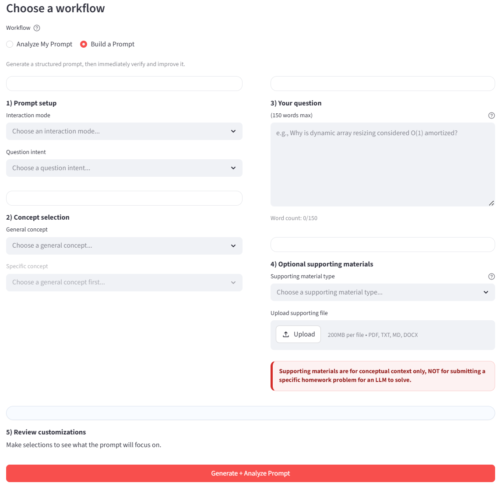
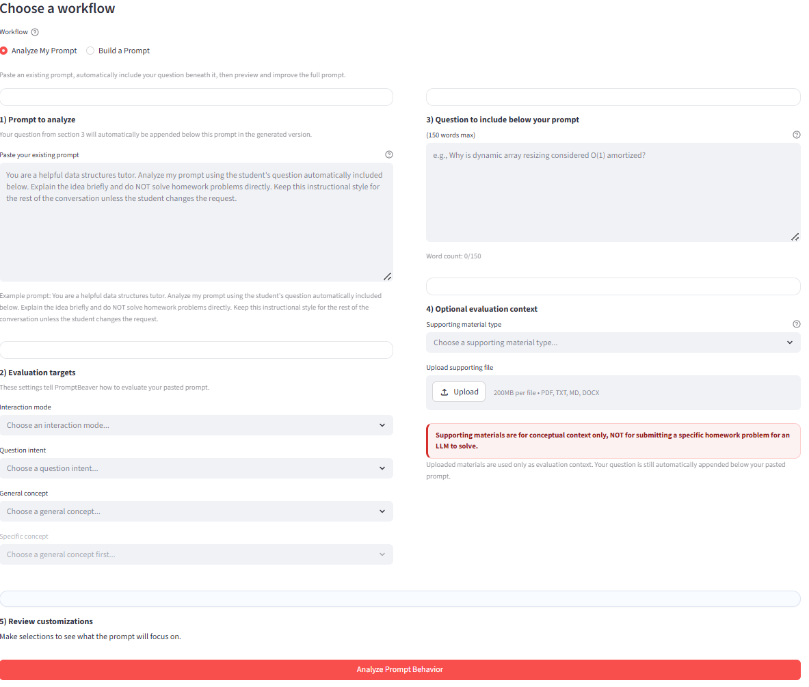

<p align="center">
  
</p>

<p align="center">
  Build smarter prompts. Learn deeper. 
</p>

---

## 🚀 Live Application

👉 https://promptbeaver.streamlit.app/

---

## 🎯 Overview

PromptBeaver is a prompt engineering tool designed for **undergraduate students studying Computer Science (CS), Data Science (DS), and/or Artificial Intelligence (AI)**.

It does **not generate answers or solve homework problems**. Instead, it helps users **build, analyze, and refine prompts** that guide LLMs toward clear, structured, conceptual explanations.

PromptBeaver supports two core workflows:

- **Build a Prompt** → Generate a structured, high-quality prompt from guided inputs  
- **Analyze My Prompt** → Evaluate and improve an existing prompt with real model behavior  

In both workflows, the **student’s question is always automatically included inside the final prompt**, ensuring the LLM responds directly to the intended question.

PromptBeaver helps students:

- Formulate **precise prompts** that clearly express conceptual questions  
- Guide LLMs toward **teaching and explanation**, not solution generation  
- Avoid prompts that lead to **answer leakage or homework completion**  
- Evaluate prompts using **LLM-based scoring and behavior previews**  
- Iteratively improve prompts through **suggested edits and revision tools**  

The result is a **refined prompt (not an answer)** that enables students to engage with LLMs in a way similar to **TA or professor office hours**.

---

## 🎓 Supported Courses

PromptBeaver is aligned with core undergraduate CS/DS/AI coursework:

- **CS 180** – Object-Oriented Programming  
- **CS 182** – Foundations of Computer Science  
- **CS 251 / CS 253** – Data Structures & Algorithms  
- **CS 373** – Data Mining & Machine Learning  

These courses guide both **concept selection and prompt structure**, ensuring prompts remain focused on conceptual mastery rather than solution generation.

--- 

## 🔁 User Interfaces
Users can either **build a new prompt** or **analyze an existing one**.


| Mode | Description |
|------|------------|
| **Build a Prompt** | Generate a structured prompt using guided selections |
| **Analyze My Prompt** | Paste an existing prompt and evaluate how it behaves |

In both modes:
- The **student’s question is automatically appended**
- The system evaluates how well the prompt **guides model behavior**

### Build a Prompt
<p align="center">
  
</p>

### Analyze My Prompt 
<p align="center">
  
</p>

---

### Required Inputs

| Input | Description | Example Options |
|------|------------|----------------|
| **Interaction Mode** | Determines how the LLM teaches and responds | Socratic Coach, Guided Tutor, Expert Explainer, Simulated Novice Learner |
| **Question Intent** | Defines the goal of the explanation | Clarify a Concept, Walk Through an Example, Check My Reasoning |
| **General Concept** | Broad subject area (based on course) | Data Structures & Algorithms |
| **Specific Concept** | Targeted subtopic within the domain | Hash Tables, Graphs |
| **User Question** | Conceptual question (≤150 words) | “Why is hash table lookup O(1) on average?” |

---

### Optional Inputs

| Input | Description |
|------|------------|
| **Supporting Materials** | Lecture slides, notes, or external context to ground the response |

---

### ✏️ Output + Customization

PromptBeaver outputs a **fully structured prompt**, along with:

- ✅ **Behavior preview** (first-turn model response)  
- ✅ **Evaluation scores** (alignment, clarity, constraints, accuracy)  
- ✅ **Concrete suggested edits** to improve the prompt  
- ✅ **Automatic or customizable revision options**  
- ✅ **Manual prompt editing with re-evaluation**  

Users can:

- Apply all suggested edits  
- Customize edits before applying  
- Manually rewrite the full prompt  
- Re-run evaluation instantly  
- Track improvements using **score deltas (↑ / ↓ / →)**  

---

## 🔍 Prompt Evaluation Metrics

Prompts are evaluated using an LLM-based verifier across four dimensions:

- **Alignment** – Matches selected mode, intent, and concept  
- **Clarity** – Clear and easy for the model to follow  
- **Constraint Adherence** – Enforces rules (e.g., no direct answers)  
- **Accuracy** – Response is instructionally correct  

Each metric is scored from **1–5**, and revisions track:

- **↑ Improvement (green)**  
- **↓ Decrease (red)**  
- **→ No change (neutral)**  

---

## 🏗️ System Architecture

<p align="center">
  
</p>

### Pipeline Overview

1. **Prompt Construction**
   - Build mode: structured prompt generated from selections  
   - Analyze mode: user prompt + question automatically combined  

2. **LLM Behavior Preview**
   - Simulates a **single-turn response**

3. **Evaluation (LLM-as-Judge)**
   - Scores prompt + response across key metrics  

4. **Feedback + Suggested Edits**
   - Returns structured issues and exact prompt edits  

5. **Revision Engine**
   - Applies edits directly or allows customization  

6. **Re-evaluation + Delta Tracking**
   - Displays score improvements (↑) or decreases (↓)

---

## ⚙️ Model & Deployment Details

PromptBeaver is deployed as a live web application using **Streamlit Cloud**, with all LLM interactions powered through **Purdue GenAI Studio**.

### Model Configuration

- **Primary Model:** `gpt-oss-120b`
- **Backup Model:** `llama4:latest`

### Usage in Pipeline

- The **primary model (`gpt-oss-120b`)** is used for:
  - Behavior preview (simulated response)
  - Prompt evaluation (LLM-as-judge)

- The **backup model (`llama4:latest`)** is used when:
  - The primary model is unavailable
  - A generation request fails or times out

### Deployment Stack

- **Frontend + Application Layer:** Streamlit (hosted via Streamlit Cloud)
- **LLM Infrastructure:** Purdue GenAI Studio API
- **Pipeline Execution:** Python-based prompt construction, evaluation, and revision loop

All model calls are integrated directly into the **prompt → response → evaluation → revision loop** described above.

--- 

## 🗂️ Repository Structure

```
PromptBeaver/
├── app.py                  # Main Streamlit application
├── prompt_builder.py       # Prompt construction logic
├── verifier.py             # LLM-as-judge evaluation + scoring
├── assets/
│   ├── prompt_beaver_mascot.png
│   ├── analyze_prompt_interface.png
    ├── build_prompt_interface.png 
│   └── mermaid-diagram.png
├── requirements.txt
└── README.md
```
---

## 🤖 AI Disclosure

AI tools were used **only** for:

- Boilerplate code generation  
- Debugging assistance  
- UI refinement  
- Initial documentation generation  

Human-driven:

- Project design  
- Evaluation metrics  
- System pipeline  
- Final edits  
