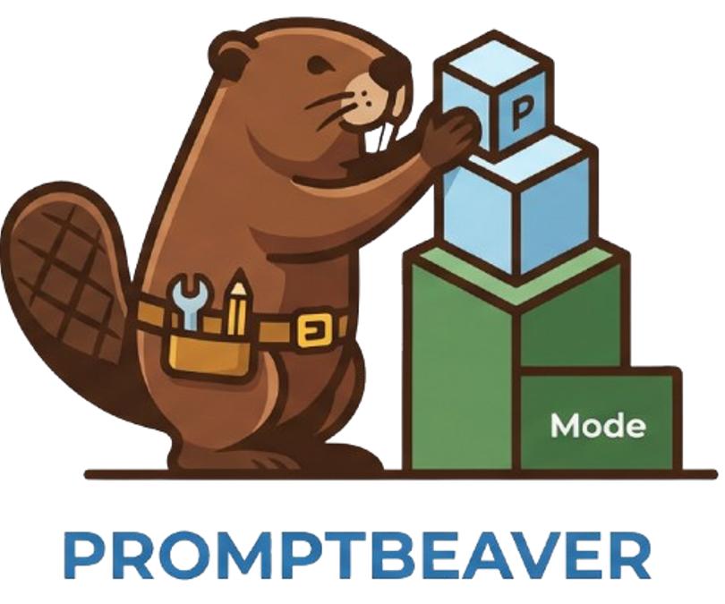
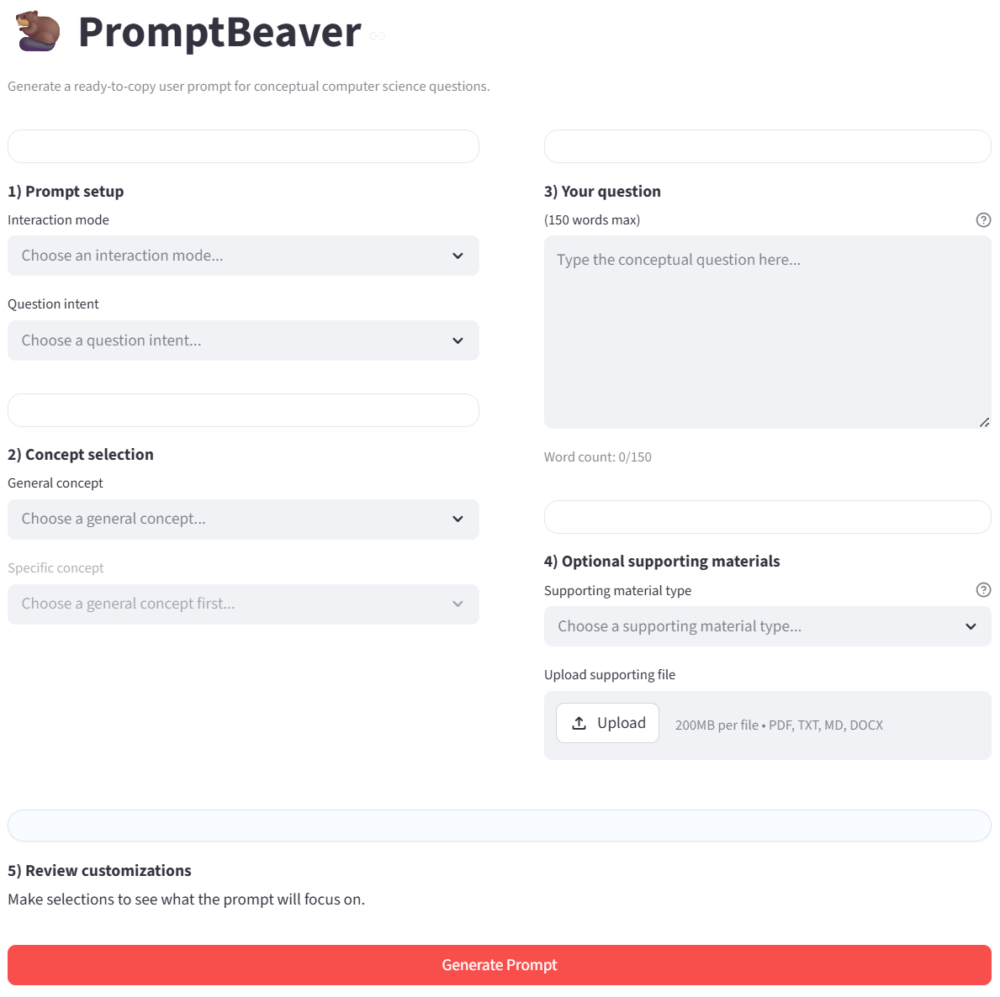
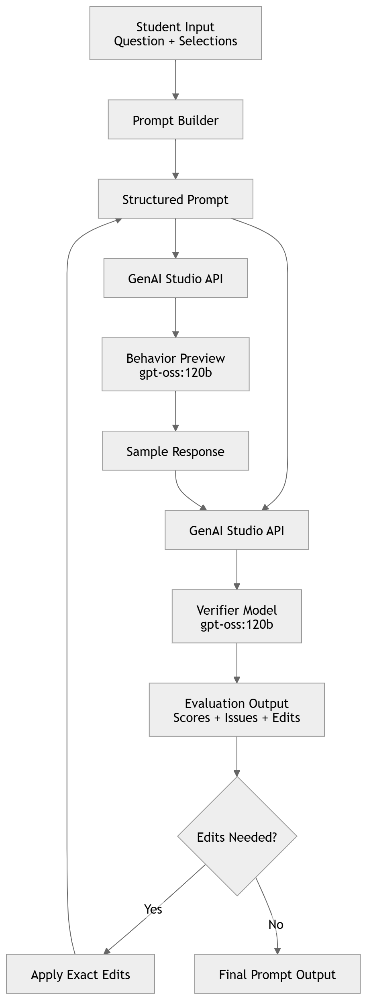

<p align="center">
  
</p>

<p align="center">
  Build better prompts. Learn better concepts.
</p>

---

## 🚀 Live Application

👉 https://promptbeaver.streamlit.app/

---

## 🎯 Overview

PromptBeaver is a prompt engineering tool designed for **undergraduate students studying Computer Science (CS), Data Science (DS), and/or Artificial Intelligence (AI)**.

It does **not generate answers or solve homework problems**. Instead, it produces a **high-quality, copy-paste-ready prompt** that students can use in **any LLM of their choice** (e.g., ChatGPT, Claude) to receive **clear, structured, conceptual explanations**.

PromptBeaver helps students:

- Formulate **precise prompts** that clearly express conceptual questions  
- Guide LLMs toward **teaching and explanation**, not solution generation  
- Avoid prompts that lead to **answer leakage or homework completion**  
- Create a **single prompt that initiates a full, high-quality learning interaction**  

The result is a **refined prompt (not an answer)**that enables students to engage with LLMs in a way similar to **TA or professor office hours**.

By making prompt engineering **explicit, structured, and learnable**, PromptBeaver empowers students to become more independent and effective learners.

---

## 🎓 Supported Courses

PromptBeaver is aligned with core undergraduate CS/DS/AI coursework:

- **CS 180** – Object-Oriented Programming  
- **CS 182** – Foundations of Computer Science  
- **CS 251 / CS 253** – Data Structures & Algorithms  
- **CS 373** – Data Mining & Machine Learning  

These courses guide both **concept selection and prompt structure**, ensuring prompts remain focused on conceptual mastery rather than solution generation.

---

## 🧠 User Input Interface

<p align="center">
  
</p>

Users configure a prompt by selecting instructional behavior, conceptual focus, and learning intent.

### Required Inputs

| Input | Description | Example Options |
|------|------------|----------------|
| **Interaction Mode** | Determines how the LLM teaches and responds | Socratic Coach, Guided Tutor |
| **Question Intent** | Defines the goal of the explanation | Clarify a Concept, Walk Through an Example |
| **General Concept** | Broad subject area (based on course) | Object-Oriented Programming |
| **Specific Concept** | Targeted subtopic within the domain | Hash Tables, Classification |
| **User Question** | Conceptual question (≤150 words) | “Why is hash table lookup O(1) on average?” |

### Optional Inputs

| Input | Description |
|------|------------|
| **Supporting Materials** | Lecture slides, notes, or external context to ground the response |

### ✏️ Output

PromptBeaver outputs a **fully structured prompt** that:

- Can be **copied and pasted into any LLM**
- Is optimized for **conceptual understanding (not answers)**
- Encourages **step-by-step explanation and guided reasoning**
- Initiates a **complete learning interaction from a single prompt**

It does **not** generate:
- Homework solutions  
- Completed code  
- Direct answers to assignments  

---

## 🏗️ System Architecture

<p align="center">
  
</p>

### Pipeline Overview

1. **Prompt Construction**
   - Structured template built from user inputs

2. **LLM Behavior Preview**
   - API call to GenAI Studio using primary model
   - Simulates real response

3. **Evaluation (LLM-as-Judge)**
   - Second API call evaluates response quality using initial prompt

4. **Scoring + Feedback**
   - Metrics computed and feedback generated

5. **Auto-Revision**
   - Prompt updated and re-evaluated

---

## 🗂️ Repository Structure

```
PromptBeaver/
├── app.py                  # Main Streamlit application
├── prompt_builder.py       # Prompt construction logic
├── verifier.py             # LLM-as-judge evaluation + scoring
├── assets/
│   ├── prompt_beaver_mascot.png
│   ├── dashboard_input.png
│   └── mermaid-diagram.png
├── requirements.txt
└── README.md
```

---

## 🤖 AI Disclosure

AI tools were used **only** for:
- Boilerplate code generation  
- Debugging assistance  
- UI refinement  
- Initial documentation generation  

Human-driven:
- Project design   
- Evaluation metrics  
- System pipeline  
- Final edits  